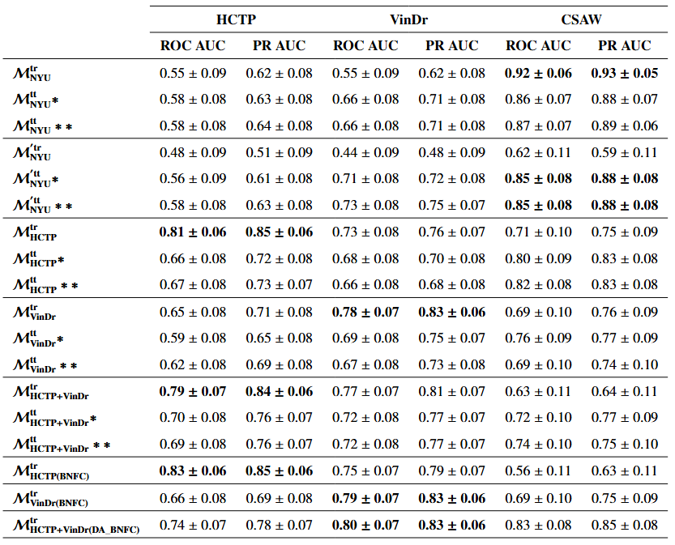
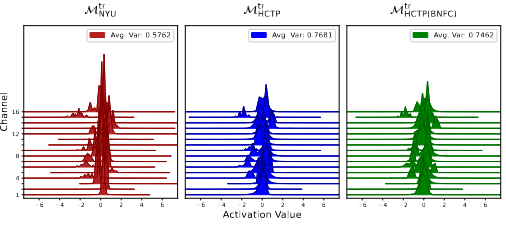
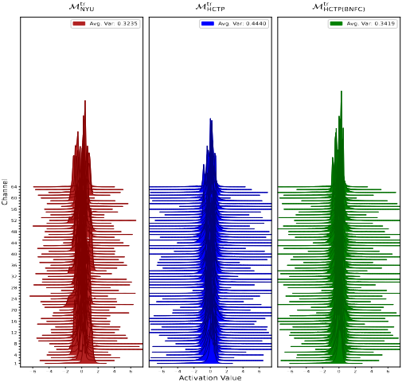
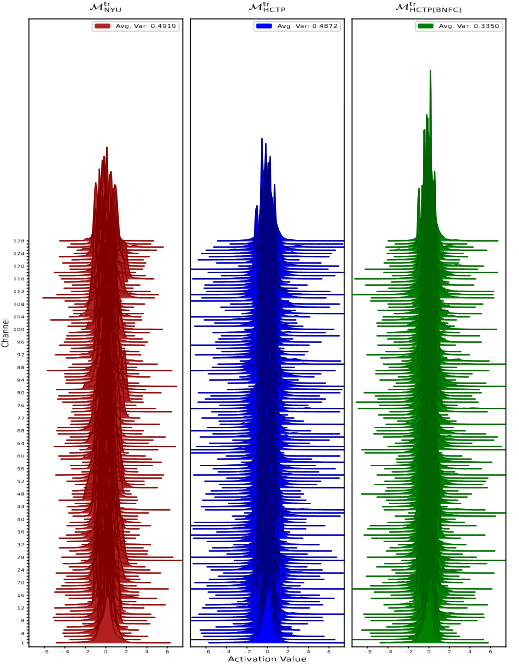

# DoSReMC: Domain Shift Resilient Mammography Classification using Batch Normalization Adaptation
This repository was created as part of [our research](https://arxiv.org/) on batch normalization layers and its effects on the mammography classification under domain shift.

**Contents of the Repository:**

- **Data Module:** Dataset class for handling mammography images, mammography-specific transforms, and data samplers for various training strategies, including domain adversarial training. [Source code for the data module](src/data).
- **Models Module:** Contains deep learning models used in this research, along with trainer and evaluator modules for model training and evaluation in various settings, including domain adversarial training. Also includes modules for schedulers and loss functions. [Source code for the models module](src/models).
- **Utils Module:** Utility methods, such as freezing layers and plotting mammography images. [Source code for the utils module](src/utils).
- **Visualization Module:** Tensorboard modules for monitoring trainings. [Source code for the visualization module](src/visualization).
- **Notebooks:** Model training notebooks for various strategies, including domain adversarial training and training only the BN and FC layers. [Source code for the training notebooks](notebooks/).

This repository serves as a valuable resource for breast cancer recognition using mammography images. Contributions, questions, and feedback are welcome.

Project Organization
------------

    ├── LICENSE
    ├── README.md          <- The top-level README for developers using this project.
    ├── .env               <- Environment variables.
    ├── data
    │   ├── external       <- Data from third party sources.
    │   ├── interim        <- Intermediate data that has been transformed.
    │   ├── processed      <- The final, canonical data sets for modeling.
    │     └── HospitalX     <- Dataset folder.
    │        └── training.xlsx   <- Metadata files contain at least the following columns: BreastID, FilePath, 
    │                               OneHotLabel, and ImageLaterality. For domain-adversarial training (DAT), add a DomainLabel column whose values are either Source or Target. 
    │        └── validation.xlsx
    │        └── test.xlsx
    │   └── raw            <- The original, immutable data dump.
    │
    ├── models             <- Trained and serialized models, model predictions, or model summaries
    │
    ├── notebooks          <- Jupyter notebooks.
    │
    ├── references         <- Data dictionaries, manuals, and all other explanatory materials.
    │
    ├── reports            <- Generated analysis as HTML, PDF, LaTeX, etc.
    │   └── figures        <- Generated graphics and figures to be used in reporting
    │
    ├── requirements.txt   <- The requirements file for reproducing the analysis environment, e.g.
    │                         generated with `pip freeze > requirements.txt`
    │
    ├── src                <- Source code for use in this project.
    │   ├── __init__.py    <- Makes src a Python module
    │   │
    │   ├── data           <- Scripts to access mammography datasets, sample data, and transform images
    │   │   └── DataSamplers.py
    │   │   └── Dataset.py
    │   │   └── Transforms.py
    │   │
    │   ├── features       <- Scripts to turn raw data into features for modeling
    │   │
    │   ├── models         <- Scripts to implement, train and evaluate models
    │   │   └── models     <- Scripts to implement models
    │   │   └── EvaluationTools.py
    │   │   └── Evaluator.py
    │   │   └── LossFunctions.py
    │   │   └── Schedulers.py
    │   │   └── Trainer.py
    │   │
    │   ├── preprocess     <- Scripts to turn raw data into features for modeling
    │   │
    │   ├── utils   <- Scripts to load configuration parameters from yaml files and to use common 
    |                  rutines of the project
    │   │   └── ActivationGradientHooks.py  <- Hooks for capturing activations and gradients.
    │   │   └── Config.py     <- Configuration class to access parameters in `config.yaml` with dot notation.
    │   │   └── Utils.py
    │   │
    │   └── visualization  <- Scripts for logging training results using TensorBoard.
    │       └── Tools.py   <- Visualization methods.
    │       └── Tensorboard.py <- Logging training events for Tensorboard.

--------

## Development Environment

For an efficient and organized development process, it is recommended to use a virtual environment. To run the code seamlessly, add the src folder to your interpreter. For users of virtualenvwrapper, run the following command in the project directory while the virtual environment is active: add2virtualenv src.

## Project Information

### 1. Data

An in-house FFDM dataset, HCTP, along with [VinDr-Mammo](https://doi.org/10.1038/s41597-023-02100-7) and [CSAW-CC (mammography)](https://doi.org/10.5878/45vm-t798), were used. The clinical data used in this study are not publicly available due to institutional data ownership and confidentiality policies. Access to the data may be considered on reasonable request and with permission from the corresponding institutional authorities.

### 3. Results
 
#### 3.1. ROC- and PR-AUC Scores

    
    
Table 2: The first column indicates the models trained on the source domain, while the header row lists the target domains used for evaluation. _tr_ and _tt_ represent the training- and test-time BN statistics used for evaluation.

 

    

    

    
    
Figure 12: KDEs of per-channel activations for BN layers in the second block of ResNet layers 2, 3, and 4.

## Reference

    @article{name, 
    title={DoSReMC: Domain Shift Resilient Mammography Classification using Batch Normalization Adaptation},
    author={Uğurcan Akyüz∗, Deniz Katircioglu-Öztürk, Emre K. Süslü, Burhan Keleş, Mete C. Kaya, Gamze Durhan, Meltem G. Akpınar, Figen B. Demirkazık, Gözde B. Akar},
    journal={},
    pages={},
    year={},
    publisher={}
   

<small>Project based on the <a target="_blank" href="https://drivendata.github.io/cookiecutter-data-science/">cookiecutter data science project template</a>. #cookiecutterdatascience</small>

